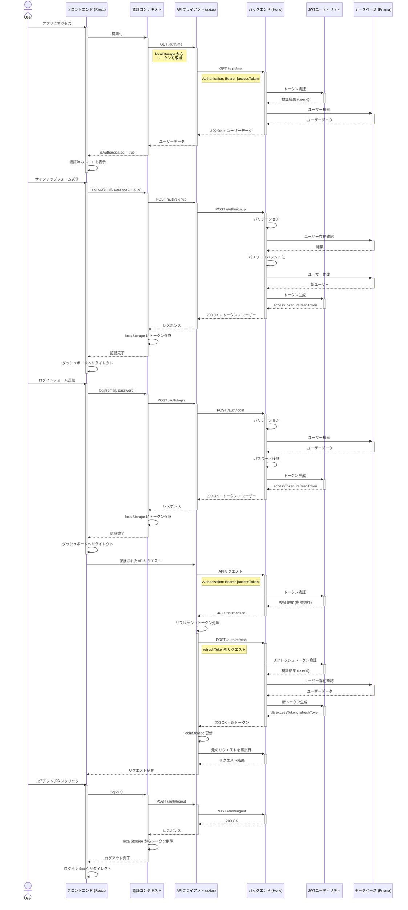

```mermaid
sequenceDiagram
    actor User
    participant Frontend as フロントエンド (React)
    participant AuthContext as 認証コンテキスト
    participant API as APIクライアント (axios)
    participant Backend as バックエンド (Hono)
    participant JWT as JWTユーティリティ
    participant DB as データベース (Prisma)

    %% 初期ロード
    User->>Frontend: アプリにアクセス
    activate Frontend
    Frontend->>AuthContext: 初期化
    activate AuthContext
    AuthContext->>+API: GET /auth/me
    Note right of AuthContext: localStorage から<br/>トークンを取得
    API->>+Backend: GET /auth/me
    Note right of API: Authorization: Bearer {accessToken}
    Backend->>+JWT: トークン検証
    JWT-->>-Backend: 検証結果 (userId)
    Backend->>+DB: ユーザー検索
    DB-->>-Backend: ユーザーデータ
    Backend-->>-API: 200 OK + ユーザーデータ
    API-->>-AuthContext: ユーザーデータ
    AuthContext-->>Frontend: isAuthenticated = true
    deactivate AuthContext
    Frontend->>Frontend: 認証済みルートを表示
    deactivate Frontend

    %% サインアップフロー
    User->>Frontend: サインアップフォーム送信
    activate Frontend
    Frontend->>+AuthContext: signup(email, password, name)
    AuthContext->>+API: POST /auth/signup
    API->>+Backend: POST /auth/signup
    Backend->>Backend: バリデーション
    Backend->>+DB: ユーザー存在確認
    DB-->>-Backend: 結果
    Backend->>Backend: パスワードハッシュ化
    Backend->>+DB: ユーザー作成
    DB-->>-Backend: 新ユーザー
    Backend->>+JWT: トークン生成
    JWT-->>-Backend: accessToken, refreshToken
    Backend-->>-API: 200 OK + トークン + ユーザー
    API-->>-AuthContext: レスポンス
    AuthContext->>AuthContext: localStorage にトークン保存
    AuthContext-->>-Frontend: 認証完了
    Frontend->>Frontend: ダッシュボードへリダイレクト
    deactivate Frontend

    %% ログインフロー
    User->>Frontend: ログインフォーム送信
    activate Frontend
    Frontend->>+AuthContext: login(email, password)
    AuthContext->>+API: POST /auth/login
    API->>+Backend: POST /auth/login
    Backend->>Backend: バリデーション
    Backend->>+DB: ユーザー検索
    DB-->>-Backend: ユーザーデータ
    Backend->>Backend: パスワード検証
    Backend->>+JWT: トークン生成
    JWT-->>-Backend: accessToken, refreshToken
    Backend-->>-API: 200 OK + トークン + ユーザー
    API-->>-AuthContext: レスポンス
    AuthContext->>AuthContext: localStorage にトークン保存
    AuthContext-->>-Frontend: 認証完了
    Frontend->>Frontend: ダッシュボードへリダイレクト
    deactivate Frontend

    %% トークンリフレッシュフロー
    Frontend->>+API: 保護されたAPIリクエスト
    API->>+Backend: APIリクエスト
    Note right of API: Authorization: Bearer {accessToken}
    Backend->>+JWT: トークン検証
    JWT-->>-Backend: 検証失敗 (期限切れ)
    Backend-->>-API: 401 Unauthorized
    API->>+API: リフレッシュトークン処理
    API->>+Backend: POST /auth/refresh
    Note right of API: refreshTokenをリクエスト
    Backend->>+JWT: リフレッシュトークン検証
    JWT-->>-Backend: 検証結果 (userId)
    Backend->>+DB: ユーザー存在確認
    DB-->>-Backend: ユーザーデータ
    Backend->>+JWT: 新トークン生成
    JWT-->>-Backend: 新 accessToken, refreshToken
    Backend-->>-API: 200 OK + 新トークン
    API->>API: localStorage 更新
    API->>+Backend: 元のリクエストを再試行
    Backend-->>-API: リクエスト結果
    API-->>-Frontend: リクエスト結果

    %% ログアウトフロー
    User->>Frontend: ログアウトボタンクリック
    activate Frontend
    Frontend->>+AuthContext: logout()
    AuthContext->>+API: POST /auth/logout
    API->>+Backend: POST /auth/logout
    Backend-->>-API: 200 OK
    API-->>-AuthContext: レスポンス
    AuthContext->>AuthContext: localStorage からトークン削除
    AuthContext-->>-Frontend: ログアウト完了
    Frontend->>Frontend: ログイン画面へリダイレクト
    deactivate Frontend
```
